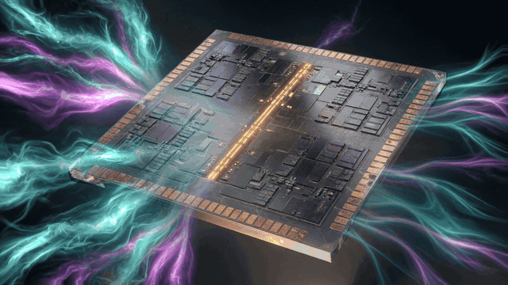

<p align="center">
  
</p>

# Helion Design Suite (1.0)

Original FPGA family + CAD. Native `aarch64-apple-darwin`. No vendor bitstream.

**We need people.** One owner, a real CAD, Apache-2.0 OR MIT. If you write Rust,
SystemVerilog, STA, IDE tests, or docs, start at
[Get involved](https://helion-fpga.github.io/helion/get-involved.html).

[Docs](https://helion-fpga.github.io/helion/)
· [Contributing](CONTRIBUTING.md)
· [Discussions](https://github.com/helion-fpga/helion/discussions)
· [Good first issues](https://github.com/helion-fpga/helion/issues?q=is%3Aissue+is%3Aopen+label%3A%22good+first+issue%22)
· [Sponsor](https://github.com/sponsors/saksham-45)

**1.0 bar:** `cargo test --workspace` (no board). SystemVerilog / VHDL / C subset through
synth → pack → PathFinder → bitgen → cycle-accurate fabric sim. 4-bit counter LED = cnt[3].

```
cargo test --workspace
cargo run -p helion-cli -- doctor
cargo run -p helion-cli -- run examples/counter.sv --cycles 16
cargo run -p helion-cli -- report_timing examples/blinky.sv
```

Legal fence: no Project X-Ray, no UNISIM, no vendor Tcl, no AMD/Intel/Lattice backends.
Device facts come from the Helion Architecture Database (HAD), never hardcoded in the CAD.

## Flow

| Step | Crate | What it does |
|---|---|---|
| synth | helion-sv | sv-parser + AIG + FlowMap LUT6 |
| vhdl | helion-vhdl | VHDL-2008 subset → same elaborator as SV |
| hls | helion-hls | C subset scheduled/bound onto LUT/FF/DSP |
| pack | helion-pack | LUTFF + IOB + MAC27 + BRAM18 |
| place | helion-place | timing-driven vs wirelength, BLE overflow |
| route | helion-route | PathFinder A* with hop delay in the cost |
| sta | helion-sta | XDC clocks / I-O delay / false path, WNS + hold |
| drc | helion-drc | occupancy, unrouted IO, clocks |
| bits | helion-bits | FeatureMap frames + sparse `.hbits` (encode/decode) + partial (DFX) |
| sim | helion-fabric | 6-input IMUX LUT + FF + IOB + STAT |
| sim | helion-sim | event kernel, agrees with the fabric |
| hw | helion-hw | IEEE 1149.1 TAP, sim cable, partial program |

Tcl Session (`helion-gui` / `helion-proj`): `synth_design`, `opt_design`, `place_design`,
`route_design`, `write_bitstream`, `write_hnf`, `get_cells/get_nets/get_pins`, `set_property`,
`report_timing`, `report_utilization`, `open_hw_manager`, `program_hw`, `mark_debug`, `eco`,
`write_checkpoint`, `report_die`. Each command drives the real engine; `.hckp` restore
reproduces the same bitstream hash.

**IR (HNF):** cells/nets/ports carry `DONT_TOUCH`, `mark_debug`, `LOC`. `helion hnf file.sv`
writes a round-trippable netlist. Checkpoints embed HNF. `(* keep *)` / `(* mark_debug *)`
and `for` generate unroll into that IR.

## QoR (HL10T-C32-1, 10.000 ns clock)

Measured by `helion qor <src>`, which prints every axis below in one line
(`helion report_utilization` / `helion report_timing` report them separately).
`crates/helion-cli/tests/qor.rs` asserts this table **and** compares each axis
against the previous Helion commit, so a LUT, WNS, bitstream-size or wall-time
regression fails the build until the row is updated **in the same commit with a
reason**.

| Design | Source | LUTFF | IOB | WNS_PS | r2r_ps | iob_ps | .hbits B |
|---|---|---|---|---|---|---|---|
| blinky | examples/blinky.sv | 1 | 1 | 9700 | 300 | 220 | 153 |
| counter | examples/counter.sv | 4 | 1 | 9640 | 360 | 220 | 185 |
| hier | examples/hier.sv | 1 | 1 | 9700 | 300 | 220 | 153 |

Gold waveform: `helion run examples/counter.sv --cycles 16` → `LED[16]=0000000111111110`
(LED = cnt[3]), identical in the fabric model and the event simulator.

### QoR change log

| Commit | Design | Was | Now | Why |
|---|---|---|---|---|
| f7d83ea | counter.sv | 4 LUT / WNS 9640 | 4 LUT / WNS 9640 | Baseline recorded when the table landed. |
| 9b864af | all | 272485 B `.hbits` | 272485 B `.hbits` | Dense stream: every frame on the die was written, zeros included. |
| this | counter.sv | 4 LUT / WNS 9640 / 272485 B | 4 LUT / WNS 9640 / 185 B | `.hbits` writes only configured frames, and FDRI runs are chunked so the 16-bit length no longer truncates. LUT and WNS held; `decode_packets` proves the stream still programs the gold waveform. |

Wall time: `helion qor` reports `ELAPSED_MS` for the whole synth → pack → place →
route → STA → bitgen flow (~30 ms per example here); the gate fails above
2000 ms, so a flow that gets slower by an order of magnitude cannot land quietly.

## Run on macOS (Apple Silicon)

Native desktop target is **`aarch64-apple-darwin`**. This repository is developed
and gated on Linux (`x86_64-unknown-linux-gnu` in CI).

**Verified on Linux**

- `cargo test --workspace --offline`
- the headless IDE model (`helion-gui::IdeModel`): Tcl console, flow rail, netlist tree
- `helion-ide --version` / `--doctor` / `--headless` / `--stdin` (no window)
- `helion doctor` prints the compile-time target triple, rustc, and the runtime HAD path
- `scripts/build-macos-app.sh --layout-only` assembles `Helion.app` (Info.plist, icon, HAD, examples)

**Not verified on this host (Linux VM — no Apple SDK, no Mach-O, no display)**

- `cargo build --release --target aarch64-apple-darwin`
- launching `dist/Helion.app` / the eframe window on a Mac
- codesign / notarization / `.icns` via `iconutil`

On an **Apple Silicon Mac** with Xcode Command Line Tools and rustup 1.85+:

```bash
git clone https://github.com/helion-fpga/helion.git
cd helion
git pull --ff-only

rustup toolchain install 1.85.0
rustup default 1.85.0
rustup target add aarch64-apple-darwin

# same suite that is green on Linux
cargo test --workspace

# native GUI + CLI bundle (runs `cargo build --release --target aarch64-apple-darwin`)
./scripts/build-macos-app.sh
open dist/Helion.app
```

The bundle lands at `dist/Helion.app`:

| Path | What |
|---|---|
| `Contents/MacOS/Helion` | windowed IDE (`helion-ide`) |
| `Contents/MacOS/helion` | CLI |
| `Contents/Resources/devices/helion` | HAD (FeatureMap / parts) |
| `Contents/Resources/examples` | `counter.sv`, `blinky.sv`, … |
| `Contents/Info.plist` | `fpga.helion.ide`, arm64-only |

Launch and sanity-check:

```bash
open dist/Helion.app
dist/Helion.app/Contents/MacOS/Helion --version
dist/Helion.app/Contents/MacOS/Helion --doctor
dist/Helion.app/Contents/MacOS/helion doctor
dist/Helion.app/Contents/MacOS/helion run \
    dist/Helion.app/Contents/Resources/examples/counter.sv --cycles 16
```

`helion gui` execs the sibling `helion-ide` / `Helion` binary (same directory as the CLI).

Without the `.app`, from the repo checkout:

```bash
cargo run -p helion-gui --release --target aarch64-apple-darwin --bin helion-ide
cargo run -p helion-cli --release --target aarch64-apple-darwin -- doctor
cargo run -p helion-cli --release --target aarch64-apple-darwin -- run examples/counter.sv --cycles 16
cargo run -p helion-cli --release --target aarch64-apple-darwin -- project examples/blinky.prj
```

`HELION_HAD` overrides the part database (otherwise the binary searches
`Helion.app/Contents/Resources/devices/helion`, then cwd, then the compile-time tree).
Native arm64 only — no Rosetta, no vendor bitstream, no Docker.
